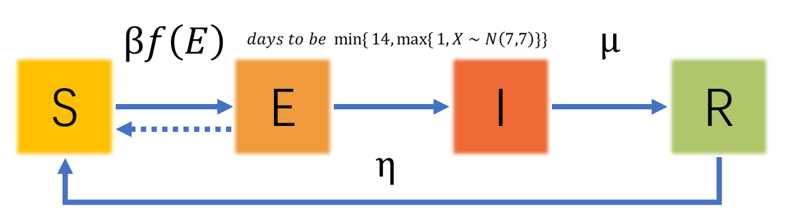
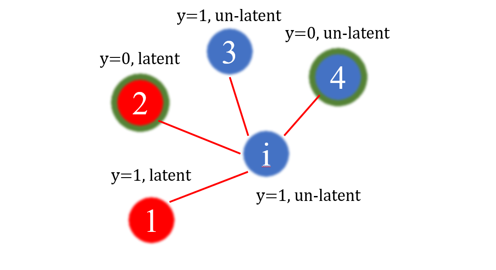

# 模型

Albert-László Barabási 和Réka Albert为了解释幂律的产生机制，提出了无标度网络模型（BA模型）。

可假设人与人间构成了 BA 网络，因为：
- 人类社会组织存在小世界性、无标度性；
- 个体间存在差异，结点的度服从幂律分布。

符号表如下。

|Notation|Description|Notation|Description|
|---|---|---|---|
|$p$|结点|$i,j$|结点代号|
|$\theta$|不注意活动接触到病毒人群流动意向|$y_i$|1，该结点开放；0则封闭|
|$\beta$|接触后感染率|$\mu$|治愈率|
|$\eta$|转变为易感人群概率|$Adj_i$|结点 $i$ 的邻接点集合|

对于每个结点，状态转移概率服从修正的 SEIR 模型：

其中，对于结点 $i$， $f_i(Adj_i)$ 为

$$f_i(Adj_i) = (1 - \prod_{j \in Adj_i \cap Latent}(1-\theta) y_j)y_i$$

$Latent$ 为潜伏期人群集合。

- - -

举例解释一下上述模型中的传染公式：

假设对于结点 $i$，其临界结点集合 $Adj_i = \{1,2,3,4\}$，其中2、4结点是封闭的。

在每天中，如果 $i$ 未封闭，则会与1、2、3、4中未封闭的点以概率 $\theta$ 进行互动，如果互动，并且 $j$ 处于潜伏期，则有 $\beta$ 的概率使 $i$ 染病。

从对立事件考虑 $i$ 患病概率，则为：

$$\beta (1 - \prod_{j \in Adj_i \cap not-seal \cap Latent}(1-\theta))$$

在数学上表达是否封闭，则加入 $y_j$ 变量，因此可定义每次迭代中，$i$ 被感染的概率为：

$$\beta f_i(Adj_i) = \beta (1 - \prod_{j \in Adj_i \cap Latent}(1-\theta) y_j)y_i$$
